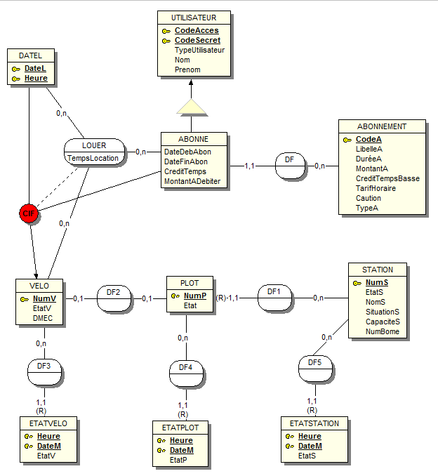
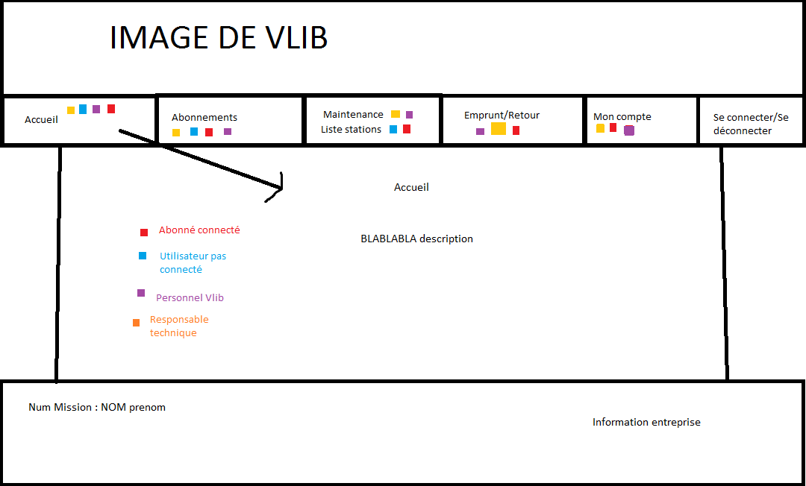

# v-lib (lkp)
projet sio2d "v-lib"

* Accès bdd
* Screen MEA
* Charte Graphique
* Tableau de bord
* Branches
* Aide Git
  * Pousser
  * Récupérer
  * Fusionner
## Accès BDD
Pour accéder a la base de donnée, se connecter a PHPMyAdmin avec l'identifiant `bodinp` et le mot de passe `bodinp`.
## Screen MEA
Petit screen des familles du MEA si ça peut aider:

## Charte Graphique
Petit screen de la charte graphique du projet:

## Tableau de bord
Pour que l'on s'y prenne bien, j'ai créée 3 'post-it' Mission #1 #2 #3. Cela représente l'intégralité de votre partie. Pour coder vous n'allez pas vous lancer dans l'écriture de votre partie entière mais morceaux par morceaux, composants par composants, qui en les rassemblant tous, constitueront la mission dans son intégralité.
Donc il faudra organiser son travail de son coté et **ne pas oublier de créer des 'post-it'** a chaque fonctionnalité créée l'assigner et écrire à quelle mission elle appartient.
De base un 'post-it' se créée dans To Do (a faire) puis on le déplace dans In Progress (en cours) quand on travail dessus. Si on est bloqué ou on a besoin d'aide on met dans Blocked. Quand c'est finis on met dans Done. Et on recommence avec une autre fonctionnalité...
## Branches
Sur notre projet il y a 3 branches:
- Master qui est la branche principale, celle ou la version finale sera rendue.
- Develop qui est la branche ou l'ensemble de chacunes de nos portions de code.
- New_Feature (une branche chacun) qui est la branche sur laquelle chacun de nous allons coder.

Par défaut, la branche principale est la Master. Ce n'est pas sur celle ci que l'on code comme expliqué plus haut. Il vous faut donc vous déplacer sur votre branche avec `git checkout -b <nom_branche>` (ici `git checkout -b feature_<votre_nom>`. Cette branche que vous créez vous est propre, c'est a dire que personne n'y a accès j'usqu'a ce qu'elle soit mergé sur Develop. Pour changer de branche on utilise `git checkout <nom_branche>`.
## Aide Git
Pour ne pas foutre en l'air le projet (même si le principe de Git nous assure une certaine sécurité), il faut impérativement vous habituer a suivre la manip suivante (si vous ne comprenez pas ce que je raconte plus bas voici une doc tres complète: https://rogerdudler.github.io/git-guide/).
### Récupérer
Pour récupérer le projet on se positionne dans un répertoire sur votre pc (la ou vous voulez le mettre en gros) dans le CMD puis on fais `git clone <lien_projet>` puis un `cd <nom_projet>` pour y entrer. Tous les fichiers du projet est téléchargé sur votre pc et vous n'avez plus qu'a commencé a coder !
ATTENTION ! Si une erreur 'it's not a git repertory' c'est une erreur proxy. Tapez: git config --global http.proxy http://172.19.239.245:3128

### Pousser
Pousser ou Push, c'est envoyer vos fichier **locaux** sur le répertoire de Git **en ligne**. Vous codez tout simplement sur votre machine en local puis une fois votre partie terminée ou à l'ajout de nouveaux fichiers, vous la poussez sur votre branche !
1. On ajoute les fichiers selectionnés (comme si on les ajoutais dans un espace virtuel) avec la commande `git add <nomfichier.php>`ou carrément tout le projet (plus rapide) avec `git add *`.
A ce moment la, les fichiers que vous avez modifiés ou tout le projet est dans un espace virtuel.
2. Pour vérifier qu'ils le sont bien on utilise la commande `git status`: un message doit apparaître avec **tous les fichier en vert**.
3. Si tout est bon, on effectue un commit, c'est à dire qu'on prépare l'envoie sur le répertoire de Git avec la commande `git commit -m "nom_commit"` (on peut refaire un `git status`pour vérifier que tout est bien commité).
4. Il ne reste plus qu'a les pousser sur le repertoire git avec `git push -u <branche>` (ici vous poussez sur votre branche).
### Fusionner
Bon normalement chacun code une fonctionnalité faisant partie de sa mission. A chaque fonctionnalité crée, on pousse sur sa branche mais il faut maintenant que le travail de chacun se regroupe ! On utilise le merge, c'est a dire la fusion de 2 branche avec `git merge <nom_branche>`. Une fois la branche Develop complète (projet terminé) on mergera le tout sur Master pour la final release.
**ATTENTION** Un merge de 2 branche les fusionnes donc attention a ne pas merge n'importe quoi et n'importe quand !
